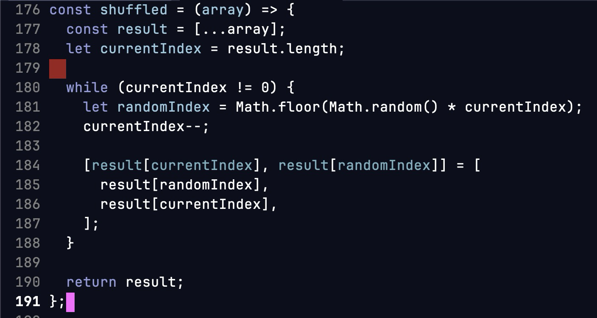

# 20260112 - Emacs whitespace visualizaton

## Motivation

코드에 존재하는 whitespace (tabs, spaces...) 를 visualize 해서 보고 싶었다.

## 1. indent-bars

[indent-bars package](https://github.com/jdtsmith/indent-bars) 는 tab stop의 visualization 기능이 있는 패키지이다.

customization을 많이 주길래 시도해보았다.

다음과 같은 문제점이 있어서 포기했다
- 너무 flickering... 내 attention span을 뺏어갔다.
- 설정을 최소화해도 완전 예측 가능한 형태가 아니었고, janky 한 부분이 있었다.

## 2. whitespace-mode

built-in 기능으로, whitespace의 visualization을 텍스트와 face로 진행한다.

모든 whitespace를 보여주니까 보기 힘들었고, leading whitespace만 띄우는 방식으로 customization 하려고 하였다.
그러나 해당 configuration은 불가능하다는 것을 알게 되었다 [Stack Exchange](https://emacs.stackexchange.com/questions/82485/whitespace-mode-only-display-leading-whitespace).

## 3. whitespace-mode: detailed를 toggle 할 수 있게 하기

whitespace-mode가 여전히 유용한 부분은 있었다 (trailing 표시 등).

그래서 기본적으론 필수적인 whitespace 표시만 하게 하고,
detailed 된 표시를 toggle할 수 있게 만들었다.

```elisp
(defvar sr/whitespace-style-basic
  '(face trailing lines newline indentation empty missing-newline-at-eof)
  "Value for `whitespace-style', highlighting essential stuff only.")

(defvar sr/whitespace-style-detailed
  '(face tabs spaces trailing lines space-before-tab newline indentation empty space-after-tab space-mark tab-mark newline-mark missing-newline-at-eof)
  "Value for `whitespace-style' with full details.")

(setq whitespace-style sr/whitespace-style-basic)

(setq-default sr/whitespace-use-detailed nil)

(defun sr/whitespace-toggle-details ()
  "Toggle detailed whitespace visualization."
  (interactive)
  (if (not whitespace-mode)
      (user-error "whitespace-mode not enabled")
    (setq-local sr/whitespace-use-detailed
                (not sr/whitespace-use-detailed))
    (setq-local whitespace-style
                (if sr/whitespace-use-detailed
                    sr/whitespace-style-detailed
                  sr/whitespace-style-basic))
                                        ; reload `whitespace-mode'.
    (whitespace-mode -1)
    (whitespace-mode 1)))
```




## Thoughts

- 공부안하고 이런거나 올리네
